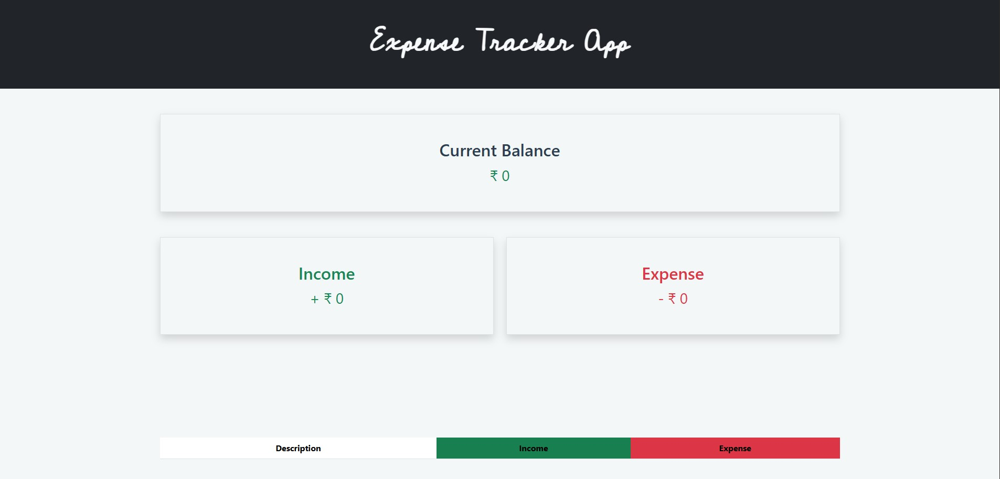

# 💸 Expense Tracker App

An intuitive and stylish Expense Tracker App built with **HTML**, **CSS (Bootstrap)**, and **JavaScript**. It helps you manage your incomes and expenses in real time, and all your data is stored locally in your browser with `localStorage`.

> "Track every rupee. Spend with purpose." – Rajdeep Singh 🧠💰

---

## 🚀 Features

- 📥 Add income with description
- 💸 Deduct expenses with reason
- 📊 Realtime balance & table update
- 💾 Data saved in localStorage (so it stays after refresh)
- 🎨 Clean responsive UI (Bootstrap vibes)
- 📱 Fully mobile-friendly
- 💻 Works on desktop and phone (same Wi-Fi trick 😉)

---

## 📸 Screenshot

  
*Make sure to add your actual screenshot in the `images/` folder and name it `screenshot.png`*

---

## 📂 Project Structure

